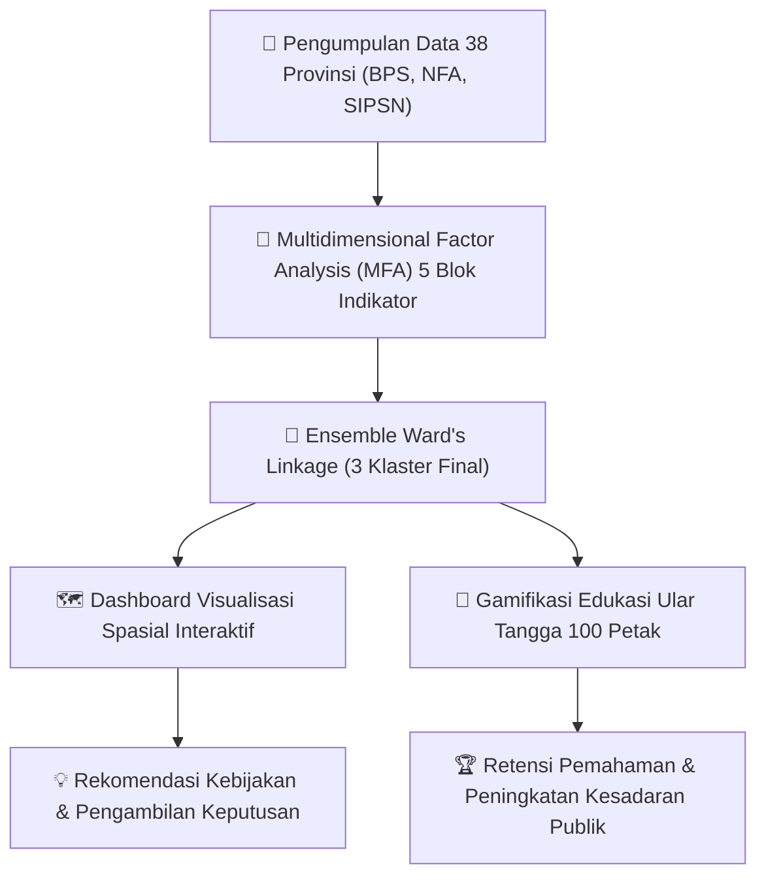

<div align="center">

# 🌾 BEKAL — Board Game, Edukasi, dan Klustering Sisa Pangan Lokal

**Platform Interaktif Analisis Spasial & Gamifikasi Edukatif Berbasis Data untuk Ketahanan Pangan Indonesia**

[](https://satriadata.kemdikbud.go.id/)
[](https://nextjs.org/)
[](https://react.dev/)
[](https://tailwindcss.com/)
[](https://leafletjs.com/)
[](LICENSE)

---

[🌐 Demo Langsung](#-tinjauan-fitur-utama) • [📊 Metodologi Statistik](#-metodologi-analisis-statistik) • [🎲 Mekanisme Permainan](#-mekanisme-gamifikasi-ular-tangga) • [🚀 Panduan Instalasi](#-panduan-instalasi-lokal) • [👥 Tim Pengembang](#-tim-pengembang)

</div>

---

## 📖 Tentang BEKAL

**BEKAL** (*Board game, Edukasi, dan Klustering sisa pAngan Lokal*) adalah karya inovasi teknologi terpadu yang dirancang untuk menjembatani jurang pemahaman masyarakat dan pengambil kebijakan terhadap persoalan **Food Loss and Waste (FLW)** serta ketahanan pangan di Indonesia.

Melalui integrasi komputasi statistik tingkat lanjut **Multidimensional Factor Analysis (MFA)** dan **Ensemble Ward's Linkage Clustering**, platform ini mengelompokkan 38 provinsi ke dalam profil kluster spesifik, kemudian mengemas wawasan tersebut ke dalam visualisasi peta tematik (*choropleth*) dan papan permainan ular tangga digital 100 petak yang interaktif.



---

## 🌟 Tinjauan Fitur Utama

### 1. 🗺️ Dashboard Spasial & Eksplorasi Data 38 Provinsi
* **Peta Choropleth Dinamis**: Menampilkan peta sebaran 38 provinsi di Indonesia dengan seleksi mode pewarnaan (*overall cluster* maupun per blok indikator).
* **Profil Radar & Biplot Dimensi MFA**: Visualisasi kekuatan relatif antarklaster pada 5 pilar indikator serta sebaran koordinat 2 dimensi MFA.
* **Tabel Eksplorasi Data & Ekspor CSV**: Memudahkan akademisi dan juri mengeksplorasi skor tiap provinsi serta mengunduh dataset secara instan.
* **Interpretasi Klaster Terpadu**: Kartu ringkasan karakteristik tiap klaster untuk memandu pembacaan data statistik.

### 2. 🎲 Permainan Ular Tangga Digital (1–4 Pemain)
* **Mode Fleksibel (Singleplayer & Multiplayer)**: Dapat dimainkan sendiri untuk latihan mandiri atau hingga 4 pemain sekaligus secara bergiliran.
* **Kuis Penyelamat Kepala Ular**: Bidak yang mendarat di petak kepala ular tidak langsung meluncur turun, melainkan diberi kesempatan menjawab kuis mitigasi sisa pangan untuk menyelamatkan posisinya.
* **Kuis Peningkat Kaki Tangga**: Menjawab benar pada petak tangga akan langsung menaikkan bidak ke puncak tangga.
* **Bonus Kocok Ulang Dadu 6**: Mendapatkan angka dadu 6 memberikan hak kocokan ekstra (hingga maks 3 kali berturut-turut).
* **Sintesis Audio Web (Web Audio API)**: Efek suara interaktif (*dice roll, fanfare, buzzer, climb, slide*) tanpa ketergantungan file audio eksternal.
* **Speedrun Timer & Papan Peringkat**: Menghitung waktu permainan secara presisi untuk menumbuhkan jiwa kompetisi yang sehat.

### 3. 🏆 Hall of Fame & Sistem Lencana (Achievements)
* Menampilkan trofi 3D yang terbuka secara otomatis seiring progres belajar pemain (*First Step, Lucky Roller, Data Explorer, Snake Charmer*).
* Menyimpan rekor waktu tercepat (*Personal Best*) secara lokal melalui teknologi *LocalStorage*.

---

## 📊 Metodologi Analisis Statistik

Analisis klasterisasi pada platform BEKAL dibangun atas 5 blok indikator utama dengan skor validitas *Average Silhouette Width* sebesar **0.4424** (struktur klaster yang kuat dan *robust*):

| Blok Variabel | Indikator Utama | Silhouette Score |
| :--- | :--- | :---: |
| **Sosial Demografi** | Indeks Pembangunan Manusia (IPM), Jumlah Penduduk | **0.6951** |
| **Food Loss & Waste (FLW)** | Volume Timbulan Sampah Tahunan, Komposisi Sampah Makanan | **0.4894** |
| **Infrastruktur** | Panjang Total Jalan (km), Persentase Jalan Kondisi Baik/Rusak | **0.4127** |
| **Produksi & Konsumsi** | Produksi Padi/Jagung/Daging/Telur, Konsumsi Per Kapita | **0.3719** |
| **Ekonomi Pangan** | Rata-rata Harga Beras, Daging Ayam, dan Telur Ayam Ras | **0.3174** |

### Ringkasan Profil 3 Klaster Final:
* **Kluster 1 (26 Provinsi - Ungu/Indigo)**: Wilayah dengan kondisi indikator "menengah" secara nasional (IPM rata-rata 75,4; panjang jalan rata-rata 13.792 km).
* **Kluster 2 (3 Provinsi - Hijau/Emerald)**: Lumbung pangan nasional di Pulau Jawa (Jawa Barat, Jawa Tengah, Jawa Timur) dengan kapasitas produksi pertanian raksasa, namun memiliki timbulan limbah makanan (FLW) tertinggi (rata-rata 225.620 ton/tahun).
* **Kluster 3 (9 Provinsi - Kuning/Orange)**: Kawasan Indonesia Timur dan NTT dengan karakteristik khusus: harga pangan hewani termahal, persentase jalan rusak berat tertinggi (5,51%), dan IPM terendah (67,7), yang mengindikasikan urgensi perbaikan rantai logistik pangan.

---

## 🛠️ Arsitektur & Teknologi

```text
datavention-web/
├── src/
│   ├── app/
│   │   ├── (dashboard)/
│   │   │   ├── achievements/page.js   # Halaman Hall of Fame & Badges
│   │   │   ├── dashboard/page.js      # Halaman Peta Spasial, Radar, & Tabel Data
│   │   │   ├── game/page.js           # Halaman Board Game Ular Tangga
│   │   │   └── layout.js              # Layout Dashboard dengan Sidebar Navigasi
│   │   ├── favicon.ico
│   │   ├── globals.css                # Tailwind CSS Setup
│   │   ├── layout.js                  # Root Next.js Layout
│   │   └── page.js                    # Landing Page Beranda
│   ├── components/
│   │   ├── IndicatorCharts.jsx        # Radar Chart Blok Indikator
│   │   ├── MapChoropleth.jsx          # Peta Choropleth Leaflet GIS
│   │   ├── MfaScatter.jsx             # Biplot 2D Koordinat MFA
│   │   ├── Sidebar.jsx                # Bilah Navigasi Samping
│   │   ├── SnakesLadders.jsx          # Mesin Logika Game Ular Tangga 100 Petak
│   │   └── Topbar.jsx                 # Bilah Navigasi Atas
│   ├── data/
│   │   ├── cluster-blocks.js          # Skor Rata-rata per Blok Klaster
│   │   ├── indonesia-38-provinces.json# Data GeoJSON Spasial 38 Provinsi
│   │   ├── mfa-data.js                # Dataset Lengkap MFA & Indikator Wilayah
│   │   └── quiz-questions.js          # Bank Soal Edukasi Ketahanan Pangan & FLW
│   └── utils/
│       ├── audio.js                   # Web Audio API Synthesizer (SoundFX)
│       └── storage.js                 # LocalStorage Management untuk Prestasi
├── package.json
├── tailwind.config.js
└── README.md
```

### Tech Stack:
* **Framework**: [Next.js 16 (App Router)](https://nextjs.org/)
* **Library UI**: [React 19](https://react.dev/), [Tailwind CSS 4](https://tailwindcss.com/), [Lucide React](https://lucide.dev/)
* **Animasi & Interaksi**: [Framer Motion](https://www.framer.com/motion/), [Canvas Confetti](https://www.npmjs.com/package/canvas-confetti)
* **Visualisasi Spasial & Grafik**: [Leaflet](https://leafletjs.com/), [React-Leaflet](https://react-leaflet.js.org/), [Chart.js](https://www.chartjs.org/), [React-ChartJS-2](https://react-chartjs-2.js.org/)
* **Audio Engine**: Native Browser Web Audio API Synthesizer

---

## 🚀 Panduan Instalasi Lokal

Pastikan Anda telah menginstal **Node.js** (versi 18 ke atas) dan **npm** / **yarn** / **pnpm** pada komputer Anda.

### 1. Clone Repository
```bash
git clone https://github.com/utsrale/Dashboard-SEC.git
cd Dashboard-SEC/datavention-web
```

### 2. Pasang Dependensi
```bash
npm install
```

### 3. Jalankan Development Server
```bash
npm run dev
```

Buka [http://localhost:3000](http://localhost:3000) pada peramban web (*browser*) Anda untuk melihat aplikasi secara langsung.

### 4. Build untuk Lingkungan Produksi
```bash
npm run build
npm start
```

---

## 👥 Tim Pengembang

Karya ini dikembangkan oleh **Tim BEKAL** dalam rangka kompetisi **Satria Data (Statistika Ria dan Festival Sains Data) 2026** — *Statistics Essay Competition (SEC)*:

* **Universitas Sebelas Maret (UNS)**
* Bidang Kajian: Statistika Terapan, Sains Data Spasial, dan Gamifikasi Edukasi Publik

---

<div align="center">
  <sub>Dibangun dengan dedikasi untuk mendukung Ketahanan Pangan Nasional dan Mewujudkan Visi Indonesia Emas 2045 &bull; SDG 2 & SDG 12.3</sub>
</div>
